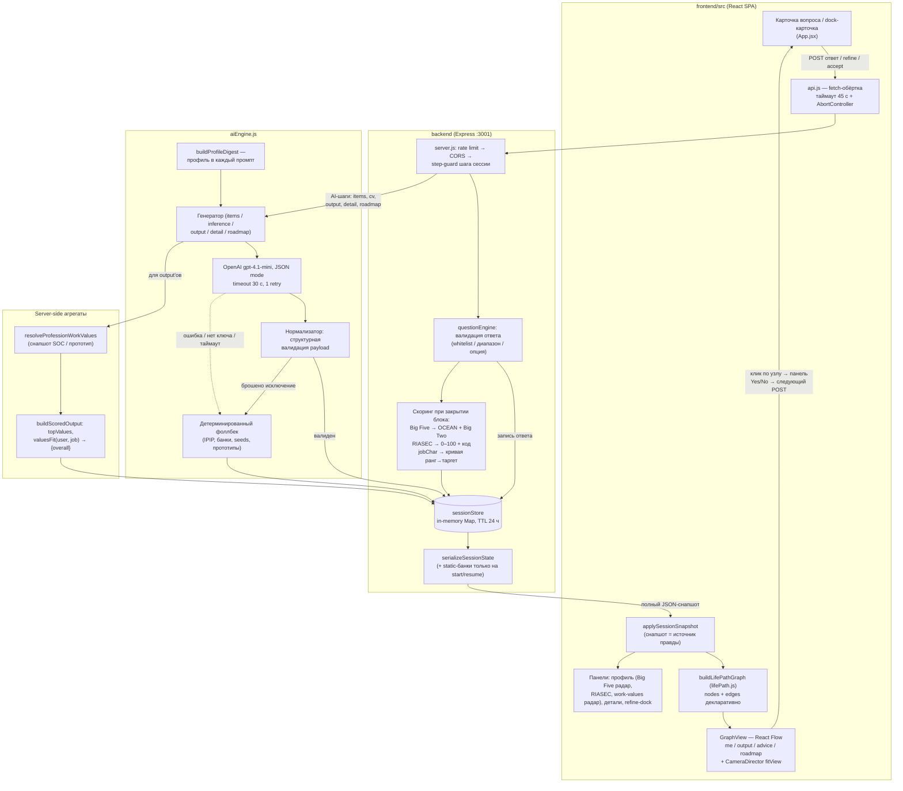

# ARCHITECTURE — Life Path Explorer

Постоянная техническая спецификация. Обновляется при изменении структуры
(вместе с `PROJECT_STATUS.md`). Актуальна на 2026-07-18 (Work-Values миграция + backend-хардеринг).

---

## 1. Общая схема

```
┌──────────────────────┐   /api/* (JSON, multipart для CV)   ┌──────────────────────────┐
│  frontend/ (SPA)     │ ──────────────────────────────────▶ │  backend/ (Express 5)     │
│  React 19 + Vite     │ ◀────────────────────────────────── │  Node, CommonJS, :3001    │
│  @xyflow/react 12    │      полный снапшот сессии          │  in-memory SessionStore   │
└──────────────────────┘                                     └────────────┬─────────────┘
                                                                          │ chat.completions
                                                                          │ (JSON mode)
                                                                          ▼
                                                             ┌──────────────────────────┐
                                                             │  OpenAI gpt-4.1-mini      │
                                                             │  timeout 30 c, 1 retry    │
                                                             │  нет ключа/ошибка →       │
                                                             │  детерминир. фоллбек      │
                                                             └──────────────────────────┘
```

Принципы обмена данными:

- **Снапшот — единственный источник правды.** Каждый мутирующий запрос
  возвращает полное состояние сессии (`serializeSessionState`); фронтенд
  применяет его целиком в `applySessionSnapshot`. Локальный стейт фронтенда —
  только view-state (индексы вопросов, busy-флаги, открытые панели).
- **Статичные банки вопросов** (`demographicQuestions`, `bigFiveItems`,
  `riasecItems`, `jobCharParams`, `careerJourneyQuestions`) едут только в
  снапшотах `start` / `GET session` / `riasec/start` (`includeStatic`);
  ответные снапшоты несут только динамику — фронтенд мёржит, а не заменяет.
- **AI никогда не отдаёт агрегаты и не скорит ценности.** Модель возвращает
  сырые баллы и тексты; всё производное (Big Two, RIASEC-код, work-values
  `topValues`/`valuesFit`) считает бэкенд детерминированно. Ценности профессии
  берутся из O*NET-снапшота (фоллбек — прототип направления), ценности
  пользователя — из явного турнира, не из AI.
- Дев-режим: Vite-прокси `/api → localhost:3001`; продакшен: Vercel rewrite
  `/api/* → https://ai-survey-backend-3g62.onrender.com/api/*`. Фронтенд-код в
  обоих случаях ходит на относительные пути.

## 2. Модули backend

| Модуль | Что делает | Вход → Выход |
|---|---|---|
| `server.js` | Все 21 роут, `trust proxy` (1 хоп в prod, `TRUST_PROXY` override), request-id middleware + leak-safe `fail`/`sendError` (см. `logger.js`), step-guard'ы, rate limiting (300/15 мин глобально, 30/15 мин AI-роуты), CORS-allowlist, multer (5 МБ), single-flight lock output/roadmap/cv-роутов (409 на параллель), `buildScoredOutput` — единственное место агрегации work-values оценок output'а. **Один инстанс** (Map/лок/лимиты — process-local) | HTTP → снапшот сессии |
| `logger.js` | Бездеп-логгер ошибок: `logError` — одна JSON-строка на ≥500 (route-шаблон / UUID-редакция, чтобы id сессии не утёк), `resolveStatus` (clamp 400..599) | (req, err) → лог |
| `sessionStore.js` | In-memory `Map` сессий (авторитетный process-local набор — **один инстанс**); TTL 24 ч, sweep раз в час (unref'd); все мутаторы (`advanceStep`, `appendOutput`, `acceptOutput`, `finalizeValues`…); `serializeSessionState`; `schemaVersion` + миграция несовместимых сессий на `hydrate()`. Опциональный write-through + `hydrate()` в Redis, если передан клиент | session-объект ↔ снапшот |
| `redisClient.js` | Фабрика Upstash-клиента: возвращает `null` без `UPSTASH_REDIS_REST_URL`/`_TOKEN` (→ чистый in-memory), иначе REST-клиент для durable сессий | env → Redis-клиент \| null |
| `questionEngine.js` | Валидация каждого типа ответа (whitelist, диапазоны) и весь скоринг: Big Five (reverse `6−raw`, нормировка `((mean−1)/4)·100`), Big Two (Stability/Plasticity), RIASEC 0–100 + топ-3 код, jobChar-таргеты из ранжирования (`rankToJobCharTargets`, кривая 90→25), прогресс | (session, answer) → normalized value / scores; бросает `{statusCode}`-ошибки |
| `questionPool.js` | Статика: 4 демо-вопроса, `JOB_CHAR_PARAMS` (7 канонических параметров — кросс-слойный контракт), 7 career-journey вопросов | константы |
| `bigFiveItems.js` | Public-domain Mini-IPIP-20 — единственный фиксированный инструмент Big Five, сидируется в сессию при создании | `MINI_IPIP_20` |
| `riasecItems.js` | Статичный фиксированный инструмент RIASEC (12 айтемов, interleaved) | `getStaticRiasecItems()` |
| `cvExtract.js` | Файл → текст: MarkItDown-first гибрид (pdf/docx/pptx/html/txt); фоллбеки pdf-parse / mammoth / tag-strip / utf8, `.pptx` без MarkItDown → 400; `getCvUploadExtensions()` для снапшота; любая ошибка чтения → 400 | multer file → string |
| `services/markitdown.js` | Обёртка опционального MarkItDown CLI: probe `--version` (кэш по пути бинаря), spawn с таймаутом 20 с, `cleanMarkdown` (картинки/ссылки/пустые строки); `MARKITDOWN_BIN` override | buffer → markdown-текст |
| `aiEngine.js` | 11 генераторов (`createAiEngine`), каждый: prompt → `runJsonCompletion` → нормализатор → при любой ошибке детерминированный фоллбек. Нормализаторы экспортированы и покрыты тестами | session-данные → валидированный артефакт |
| `prompts.js` | Билдеры промптов; `BASE_SYSTEM` (анти-tech-bias, «dream — не фильтр домена»); `buildProfileDigest` — единый текстовый дайджест профиля, попадает в каждый content-промпт | параметры → `{system, user}` |
| `directions.js` | Каталог 15 field-families (алфавитный намеренно — никакой домен не первый в детерминированных обходах): label, examples, 3 `professionSeeds`, id для work-value прототипов | `getDirection(id)`, `DIRECTION_IDS` |
| `riasec.js` | Holland-веса каждого направления; `rankDirections(scores, {excludeIds})` — взвешенный dot-product; `inferRiasecScores(bigFive)` — эвристика на мета-аналитических связях для skip-пути | RIASEC-вектор → ранжированный каталог |
| `workValues.js` | Чистый модуль шести Minnesota / O*NET work values: `WORK_VALUES_ORDER` (6 ключей), `rankToWorkValueScores` (rank→интенсивность + `curveVersion`), `deriveTopValues`, `valuesFit` (centered cosine → одно `{overall}` 0–100), прототипы направлений + `buildFallbackProfessionValues` (модуляция jobChar-таргетами) | вектора 0–100 → агрегаты |
| `valuesTournament.js` | Чистый Ford–Johnson merge-insertion движок: реплей решённых сравнений (resumable, иммунен к stale/двойным ответам), ≤10 сравнений для 6 items, доказано на всех 720 перестановках | (items, decided) → следующее сравнение \| финальный порядок |

## 3. Структура вопросов

> Детальные алгоритмы вопросов и скоринга (формулы Big Five/RIASEC, турнир
> ценностей Ford–Johnson с воркед-примером, Pearson-заземление профессий,
> `valuesFit`) вынесены в [`ASSESSMENT-LOGIC.md`](ASSESSMENT-LOGIC.md). Здесь —
> только структура.

Старой системы «branch themes» (адаптивный пул из 38 вопросов v1) больше нет —
она удалена вместе с legacy CRA (тег `archive/legacy-cra-2026-07`). Текущая
логика — **линейный step-конвейер с per-session генерацией инструментов**:

1. Порядок шагов фиксирован (`session.step`), каждый роут охраняется guard'ом
   «не тот шаг → 400». Назад по шагам сервер не ходит; «← Back» на фронтенде —
   навигация по уже отвеченным вопросам внутри блока (перезапись ответа).
2. Адаптивность достигается не ветвлением, а:
   - адаптивным попарным турниром work-values (Ford–Johnson, ≤10 сравнений);
     Big Five, RIASEC и jobChar — фиксированные инструменты без AI-генерации;
   - персональным ранжированием 7 jobChar-параметров, из которого
     детерминированная кривая выводит таргеты;
   - опциональными путями: RIASEC-skip (инференс), CV-текст vs 7
     journey-вопросов.
3. На Page 3 «ветвление» — это цепочка output'ов: каждый refine/notSuitable
   добавляет `output_N` с `parentId` на предыдущий; принятый output
   отращивает 4 advice-узла и цепочку roadmap-шагов.

## 4. Контракты данных

### 4.1 Ответы пользователя (frontend → backend)

| Шаг | Payload |
|---|---|
| Старт сессии | `{dreamAnswer}` — обязателен, trim + кап 500 |
| Values (турнир) | `/start` → `{comparisonId, a, b}`; `/answer {comparisonId, winner}` (stale — no-op); `/confirm {order}` — перестановка 6 ключей |
| Демография | `{sessionId, questionId: "sex"\|"age"\|"country"\|"city", value}` |
| Big Five | `{sessionId, itemId, value: 1–5}` |
| RIASEC | `{sessionId, itemId, value: 1–5}` |
| JobChar ранжирование | `{sessionId, ranking: [7 id, перестановка]}` — закрывает шаг, таргеты выводит кривая ранг→значение |
| CV intent | `{sessionId, cvIntent: "new"\|"use_skills"}` — выбирается на CV-слайде, перевыбор разрешён |
| CV | JSON `{sessionId, cvText}` **или** multipart `sessionId` + `file` |
| Journey | `{sessionId, questionId: "cj_…", value: string ≤400}` |
| Refine | `{sessionId, outputId, changes: [{param, reason ≤200}]}` **XOR** `{sessionId, outputId, notSuitable: true}` |

Канонические ключи (контракт между промптами, скорингом, сессией и UI):
- 7 jobChar-параметров: `compensation, work_mode, job_security, career_growth, complexity, meaning_impact, social`;
- 6 work-values: `achievement, independence, recognition, relationships, support, working_conditions`.

### 4.2 JSON-схемы AI-ответов (все вызовы — JSON mode; нормализатор бросает → фоллбек)

| Генератор | Схема ответа модели | Ключевые проверки нормализатора |
|---|---|---|
| RIASEC inference (t=0.4) | `{scores:{R..C: int}}` | все 6 конечные числа, clamp 0–100 |
| JobChar questions (t=0.8) | `{items:[{param, text, options:[{value, label}]}]}` | ровно count, param ∈ ranking, 3–4 опции, value clamp 0–100; сортировка по ранжированию |
| CV parse (t=0.2) | `{skills:[], domains:[], seniority}` | ≥1 skill, лимиты 12/6, обрезка строк |
| Persona summary (t=0.6) | `{summary}` | непусто, 3–5 предложений, кап 700 симв. |
| Why this fits (t=0.6) | `{personality:[{point}×2], interests:[{point}], values:[{point}], currentSkills:[{point}×2–3], skillsToDevelop:[string×3–4]}` | жёсткие счётчики на блок, обрезка перебора, кап 220/80 симв.; `values`-буллет таргетит топ work-value |
| Oriented Field / 1st Output (t=0.8) | `{orientedField, jobTitle, thesis, parameterFit:{7 ключей}, whyFit, firstMilestone, constraintsNote}` | все 6 текстов непустые, все 7 parameterFit-строк непустые |
| Refinement (t=0.8) | та же схема + `changeSummary` | как output; changeSummary дефолтится |
| Output detail (t=0.7) | `{aiRecommendations:[{title,detail}], events:[{name,why}], universities:[{name,program}], courses:[{name,provider,why}]}` | каждый блок ≥2 валидных записей, обрезка до 4 |
| Roadmap (t=0.7) | `{stages:[{title, description, timeframe, milestone}]}` | ≥4 стадий (обрезка до 8), title+description обязательны |

Каждый content-промпт получает `buildProfileDigest`: dream (с пометкой «не
фильтр домена»), демография, OCEAN 0–100, Big Two, RIASEC-вектор + код (+флаг
inferred), подтверждённая иерархия work-values, ранжированные jobChar-таргеты,
CV-сигнал (парсинг / сырой фрагмент ≤300 симв. / journey-ответы) и intent
(use_skills/new), когда тот уже выбран.

### 4.3 Снапшот сессии (backend → frontend)

`serializeSessionState` возвращает: идентичность (`sessionId`, `dreamAnswer`,
`step`, `pathStage`), статичные банки (только с `includeStatic`), все ответы и
скоры (`demographics`, `bigFiveAnswers/Scores`, `derivedTraits`,
`personaSummary`, `cvIntent`, `riasec*`, `jobChar*`, `careerJourneyAnswers`,
`cvAnalysis`, `cvProvided`), `userValues` (иерархия из турнира) +
`valuesComparison`/`valuesRanking` (текущий пейринг / финальный порядок, оба
null после confirm), `progress`, `summary`, output-цепочку (`outputs[]` с
`workValues`/`topValues`/`valuesFit` и `whyThisFits`, `acceptedOutputId`,
`refinementHistory`, `roadmaps`), плюс `aiEnabled` — честный флаг «работает AI
или demo-фоллбек». Скоринговые ключи пунктов (`trait`, `reverse`, `type`) в
снапшот не попадают никогда. Ошибочные ответы несут `requestId` (+ заголовок
`X-Request-Id` на каждом ответе).

## 5. Состояние сессии: где живёт и что это ограничивает

Сессии — `Map` в памяти процесса (`sessionStore.js`), TTL 24 ч от
`updatedAt`, sweep раз в час. Клиент хранит только `sessionId` в
localStorage и восстанавливается через `GET /api/session/:id`.

**Опциональная durable-персистентность (Upstash Redis).** Если заданы
`UPSTASH_REDIS_REST_URL` + `UPSTASH_REDIS_REST_TOKEN` (`redisClient.js`),
`SessionStore` работает write-through: Map остаётся авторитетным рабочим
набором для синхронного `require()/get()`, а каждая мутация (`createSession`,
`touch`) пишет весь объект сессии в Redis с нативным EX-TTL. При старте
`store.hydrate()` перечитывает сессии обратно в Map (SCAN + GET) — поэтому
процесс переживает рестарт/усыпление Render. `/api/health` отдаёт
`sessionStore: "redis"|"memory"`. Без креды — прежний чистый in-memory, и
локально/в тестах Redis не нужен.

Оставшиеся ограничения:
- **Один процесс.** Горизонтальное масштабирование по-прежнему невозможно: Map,
  single-flight lock и rate-limit счётчики живут в одном процессе. Второй
  инстанс не увидит write-through другого до собственной `hydrate()`.
- **Write-through — fire-and-forget.** Единственная невосстановимая потеря —
  краш между мутацией и её записью без последующей мутации; каждая запись
  содержит весь объект, поэтому обычно самозалечивается на следующей мутации.
- **Нет аутентификации владельца**: единственный «секрет» — непрозрачный UUID
  сессии.
- Без Redis — рестарт процесса всё ещё теряет все сессии (дефолт для
  локали/демо).

## 6. Диаграмма потока данных

От ответа пользователя до отрисовки графа:



Ключевое свойство цикла: фронтенд никогда не «додумывает» состояние — любое
действие = POST → новый снапшот → полная пересборка графа. Узлы/рёбра не
мутируются императивно.

## 7. Техническая оценка

Честная инженерная оценка на 2026-07-11.

### 7.1 Что архитектура выдержит, а что нет

**Выдержит:** рост числа вопросов и направлений — банки и каталог чисто
данные, скоринг обобщён; смену модели OpenAI (один env-var); рост фич Page 3 —
output-цепочка и work-values слой расширяемы и хорошо оттестированы.

**Не выдержит без работ:**
- **Более одного инстанса бэкенда.** Всё состояние в памяти одного процесса —
  включая single-flight lock output-роутов и rate-limit счётчики; Redis-стор
  переживает рестарт, но не даёт консистентности между инстансами.
- **Заметного трафика на AI-роуты.** Нет учёта токенов, нет бюджетных
  предохранителей кроме rate limit.

**Потеря сессий на рестарт устранена** для прода: при заданной Upstash-креде
`SessionStore` персистит write-through и гидрируется при старте (§5). Без
креды (локаль/демо) поведение прежнее — in-memory.

### 7.2 Проблемные места (по убыванию важности)

1. **Обработка ошибок AI хороша, но слепа.** Фоллбек срабатывает молча для
   оператора: единственный след — `console.error` в эфемерных логах Render.
   Нет метрики «доля fallback-ответов» — можно неделями отдавать demo-контент
   с невалидным ключом и не знать (UI покажет «Demo mode» только при
   *отсутствии* ключа, не при систематических отказах API).
2. **Валидация ответов пользователя** — сильная (whitelist на всё, диапазоны,
   step-guard'ы, capped strings). Слабое место одно: `dreamAnswer`, `reason` и
   journey-ответы попадают в промпты как есть — классический prompt-injection
   канал. Риск ограничен (модель отвечает в JSON mode строгому нормализатору,
   у сессии нет привилегий), но упомянуть инъекцию в system-промпте стоит.

### 7.3 Качество AI-слоя (aiEngine + prompts)

Сильная сторона проекта; уровень выше типичного MVP:

- **Парсинг устойчив**: JSON mode + `parseJsonObject` с тремя ступенями
  (прямой parse → срез markdown-fence → срез до внешних скобок).
- **Каждый payload проходит структурный нормализатор**, и нормализаторы
  реально строгие (точные количества, доли reverse,
  «≥2 записей на блок» для советов). Невалидный ответ модели не долетает до
  пользователя — уходит в детерминированный фоллбек. Нормализаторы покрыты
  тестами напрямую.
- **Агрегаты отделены от генерации**: модель не может выдать несогласованный
  valuesFit — он всегда считается из сырых баллов на сервере (а ценности
  вообще не скорятся AI).
- **Промпты дисциплинированные**: явная схема в каждом system-промпте,
  анти-tech-bias и «dream ≠ фильтр домена» в `BASE_SYSTEM`, температуры
  осмысленно разведены (0.2 парсинг CV → 0.85 генерация пунктов).

Слабости AI-слоя:
- **Нет retry на *невалидную структуру***: `maxRetries: 1` покрывает сетевые
  ошибки, но структурно кривой JSON сразу роняет вызов в фоллбек. Один
  повторный запрос с сообщением об ошибке валидации заметно поднял бы долю
  AI-ответов (актуально для Big Five items — самый строгий валидатор).
- **Фоллбеки неотличимы для аналитики** — флага «этот артефакт из фоллбека»
  в сессии нет (кроме глобального `aiEnabled`), измерить их долю нельзя.
- **`refineOutput` наследует `directionId` предыдущего output'а**, даже если
  AI фактически сменил область; `output/first` присваивает
  `directionId = ranked[0]` независимо от того, куда реально ушла модель.
  Влияет на work-value фоллбек и на исключение семейств в notSuitable —
  неточность, о которой стоит помнить.

### 7.4 Статус приоритетных фиксов

Закрыто 2026-07-11 (партия приоритетных фиксов):
- ✅ **`trust proxy`** — `app.set("trust proxy", resolveTrustProxy())`, 1 хоп в
  production, `TRUST_PROXY` override; rate limiting снова per-client.
- ✅ **Персистентность сессий** — опциональный Upstash Redis write-through +
  hydrate (§5); включается credentials, без них — прежний in-memory.
- ✅ **Идемпотентность output-роутов** — single-flight lock (409 на
  параллельный/повторный запрос) на `output/first|refine|accept` и
  `roadmap/generate`.
- ✅ **Документация** — README переписан под v2, домены/имя сервиса в
  DEPLOY.md + render.yaml приведены к реальности.
- ✅ Мёртвый `normalizeRefinePayload` (латентный `ReferenceError`) удалён;
  неиспользуемая `reactflow@11` убрана.

Остаётся, в порядке приоритета:

| # | Действие | Причина |
|---|---|---|
| 1 | Метрика fallback-доли + структурный retry | Качество продукта напрямую = доля настоящих AI-ответов, а она сейчас неизмерима |
| 2 | E2E-тест полного пути | Интеграция App.jsx ↔ снапшот ↔ граф покрыта только unit-тестами |
| 3 | Контроль расходов OpenAI | Нет учёта токенов и бюджетных предохранителей |
| 4 | Мульти-инстанс (при масштабировании) | Map / single-flight lock / rate-limit счётчики привязаны к процессу |
