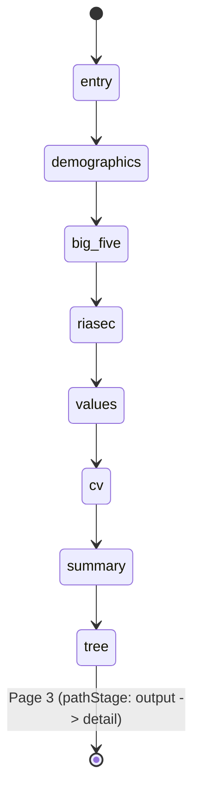
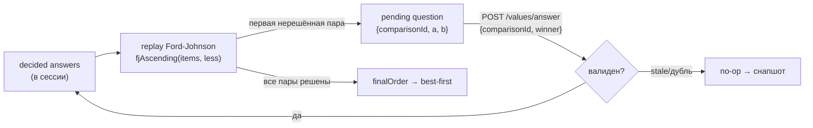
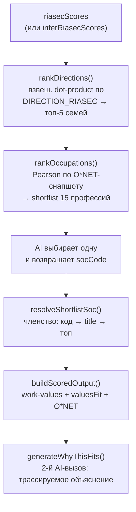

# ASSESSMENT-LOGIC — Life Path Explorer

Детальное описание **логики вопросов и алгоритмов** приложения: что именно
спрашивается на каждом шаге, как ответы превращаются в баллы, и как эти баллы
заземляют профессии на Page 3.

> Синхронизировано с кодом на коммите `2eaaa37` (ветка `backend-hardening`),
> 2026-07-21. Все формулы и константы взяты из исходников напрямую. **Если
> число здесь расходится с кодом — прав код.** Каждый раздел ссылается на
> источник как `файл.js:функция`.

**Область этого документа vs остальные:**

| Документ | О чём |
|---|---|
| **`ASSESSMENT-LOGIC.md`** (этот) | Алгоритмы вопросов, скоринга и заземления — *как считается* |
| `ARCHITECTURE.md` | Система, модули, контракты данных, потоки — *как устроено* |
| `README.md` | Список API-роутов, запуск, стек |

Термины (идентификаторы, ключи, имена функций) намеренно оставлены
английскими — они цитируют код.

---

## 0. Две сквозные инварианты

Прежде чем разбирать вопросы, два правила, которые действуют на всём протяжении:

1. **Снапшот сессии — единственный источник правды.** Любой мутирующий запрос
   возвращает *полное* состояние сессии (`serializeSessionState`), фронтенд
   применяет его целиком. Никакие баллы не живут на клиенте — он их только
   рисует.
2. **Конвейер строго линеен.** Порядок шагов фиксирован в `session.step`, каждый
   роут защищён guard'ом «не тот шаг → 400/no-op». Сервер назад по шагам не
   ходит; «← Назад» на фронте — это навигация по уже отвеченным вопросам
   *внутри* блока (перезапись ответа), не откат шага.



«Адаптивность» здесь достигается **не ветвлением дерева вопросов**, а: адаптивным
попарным турниром work-values (Ford–Johnson), персональным ранжированием 7
job-характеристик, per-session AI-генерацией артефактов с жёсткими валидаторами и
детерминированными фоллбеками, и опциональными путями (RIASEC-skip, CV-текст vs
journey-вопросы). Сам порядок блоков неизменен.

---

## 1. Entry — мечта

**Роут:** `POST /api/session/start`. **Источник:** `server.js`.

Один обязательный свободный ответ `dreamAnswer` — что человек хочет от жизни/
работы. Валидация: `trim`, непустой, кап **500 символов**. Он не скорится
числом — это затравка, которая едет в каждый AI-промпт (`buildProfileDigest`)
как контекст. Выбор `cvIntent` (`new` | `use_skills`) делается **позже**, на
CV-слайде, не здесь.

При старте сессии в неё сразу сидируется фиксированный инструмент Big Five
(`MINI_IPIP_20`) — вопросы не генерируются на лету.

---

## 2. Демография

**Роуты:** `GET`-снапшот несёт вопросы; ответ — `POST` с `{questionId, value}`.
**Источник:** `questionPool.js:DEMOGRAPHIC_QUESTIONS`,
`questionEngine.js:validateDemographicAnswer`.

Четыре статичных вопроса, три вида валидации:

| id | kind | Валидация |
|---|---|---|
| `sex` | `single` | `value` обязан быть одним из `female / male / other / prefer_not` |
| `age` | `number` | целое/дробное в диапазоне **13–99** |
| `country` | `text` | непустой после `trim`, **≤80** символов |
| `city` | `text` | непустой после `trim`, **≤80** символов |

Ответ вне whitelist / диапазона → `400`. Завершение всех четырёх переводит шаг
сразу в `big_five`.

---

## 3. Big Five (OCEAN) — личность

**Инструмент:** `bigFiveItems.js:MINI_IPIP_20` — public-domain Mini-IPIP,
**20 пунктов, по 4 на каждую из 5 черт** (O, C, E, A, N). Единственный
фиксированный инструмент, никакой AI-генерации. Ответ — Likert **1–5**
(`validateBigFiveAnswer`: целое 1–5, иначе 400).

**Источник скоринга:** `questionEngine.js:computeBigFiveScores`,
`deriveBigFiveTraits`.

### 3.1 Сырой → нормированный балл

Часть пунктов **обратные** (`reverse: true`) — согласие с ними означает *низкую*
черту (например, mip_6 «I don't talk a lot.» для Extraversion). Для них балл
инвертируется:

```
scored = reverse ? (6 - raw) : raw          // raw ∈ 1..5  →  scored ∈ 1..5
```

Затем по каждой черте берётся среднее её 4 пунктов и линейно растягивается в
0–100:

```
mean_trait = Σ scored / 4
score_trait = round( ((mean_trait - 1) / 4) * 100 )     // 1→0, 3→50, 5→100
```

Результат — `bigFiveScores = { O, C, E, A, N }`, каждый 0–100.

### 3.2 Big Two (мета-черты DeYoung)

Из OCEAN детерминированно выводятся две мета-черты (`deriveBigFiveTraits`):

```
Stability  (behaviourTendencies)  = round( (A + C + (100 - N)) / 3 )
Plasticity (decisionPriorities)   = round( (O + E) / 2 )
```

> Имена полей `behaviourTendencies` / `decisionPriorities` сохранены ради
> обратной совместимости API; в тексте для пользователя используются настоящие
> названия **Stability** (composure & self-discipline) и **Plasticity** (drive
> toward the new). Пороги в `describeTraits`: **≥65 — high**, **≤35 — low**,
> между — balanced.

### 3.3 Договорённость отображения нейротизма

В хранилище лежит **сырой N** (высокий = более тревожный). В UI он
показывается как **«Emotional Steadiness» = 100 − N** (высокий = спокойнее).
Скор не переписывается — инвертируется только подпись.

---

## 4. RIASEC — интересы (Holland)

**Инструмент:** `riasecItems.js:getStaticRiasecItems` — **12 пунктов, по 2 на
каждый из 6 типов** R, I, A, S, E, C. Пул содержит по 3 формулировки на тип, но
инструмент берёт первые 2 и **чередует** типы (R, I, A, S, E, C, R, I, …), чтобы
однотипные пункты не шли блоком. Формулировки — это *активности* («Analysing
data to find the pattern behind it»), оцениваемые по удовольствию 1–5, никогда
не названия профессий.

**Источник скоринга:** `questionEngine.js:computeRiasecScores`,
`deriveRiasecCode`. Валидация — та же, что у Big Five (целое 1–5).

### 4.1 Баллы и код

По каждому типу — среднее его 2 пунктов, та же нормировка в 0–100:

```
score_type = round( ((mean_type - 1) / 4) * 100 )
```

`riasecCode` — топ-3 типа по убыванию балла, склеенные в строку (например
`"SIA"`). Тай-брейк — канонический порядок **R-I-A-S-E-C** (`deriveRiasecCode`
сортирует по `score desc, index asc`).

### 4.2 Путь пропуска (skip)

Если пользователь пропускает квиз, интересы **выводятся из Big Five**
(`riasec.js:inferRiasecScores`) — эвристика по мета-анализам (Barrick/Mount 2003,
Larson 2002):

```
R = 0.5·(100−O) + 0.5·(100−E)      // низкая открытость + интроверсия
I = 0.7·O + 0.3·(100−E)
A = 0.8·O + 0.2·(100−C)
S = 0.55·A + 0.45·E
E = 0.65·E + 0.35·C
C = 0.7·C  + 0.3·(100−O)
```

Профиль помечается `riasecInferred` (низкая уверенность). Отсутствующий вход →
нейтральные 50.

---

## 5. Турнир ценностей — сердце ассессмента

Шесть Minnesota / O*NET Work Values (`workValues.js:WORK_VALUES_ORDER`):
`achievement, independence, recognition, relationships, support,
working_conditions`. Это **шесть независимых шкал** (в отличие от кругового
Schwartz, который они заменили).

Пользователь не выставляет баллы напрямую — он проходит **адаптивный попарный
турнир**, из которого получается строгий полный порядок (иерархия). Магнитуды
потом назначаются по фиксированной кривой.

### 5.1 Движок Ford–Johnson (merge-insertion)

**Источник:** `valuesTournament.js`.

Почему именно он: сортировка n=6 сравнениями merge-insertion укладывается в
**≤10 сравнений** — это информационно-теоретический минимум
(⌈log₂(6!)⌉ = ⌈9.49⌉ = 10). То есть «10 вопросов» — не произвольный бюджет, а
доказанный потолок.

**Ключевое свойство — движок это чистая функция от `(items, decided)`.** Он не
хранит «текущий вопрос»; каждый вызов *заново проигрывает* сортировку, скармливая
ей уже принятые ответы, и первая пара, которую сортировка ещё не может решить,
становится ожидаемым вопросом (`NeedComparison`). Отсюда три следствия:

- **resumable / сериализуемо** по HTTP — в сессии лежат только `decided`;
- **иммунно к устаревшим/двойным ответам** — `recordAnswer` принимает ответ
  только на *текущую* ожидаемую пару, всё прочее — no-op;
- фронтенд может «пере-спросить» — состояние всегда восстановимо.



Механика внутри `fjAscending` (ascending под `less`, где `less(x,y)` = «x менее
важна, чем y»; `finalOrder` в конце реверсит в «важное первым»): пункты бьются на
пары, `big`/`small` определяются одним сравнением; `big`-и рекурсивно
сортируются; затем `small`-ы вставляются бинарным поиском в отсортированную цепь
в порядке «больший партнёр первым» (`insertionOrder`) — так каждая вставка
попадает в диапазон из 2ᵏ−1 слотов, что и даёт оптимум. Оптимальность (≤10 для
всех перестановок) **доказана исчерпывающе по всем 720 перестановкам** в тестах
(`backend/tests/`).

### 5.2 Воркед-пример (9 сравнений)

Пусть истинная важность пользователя (важное → неважное):

```
independence > achievement > relationships > recognition > working_conditions > support
```

Движок задаёт вопросы в таком порядке (winner = что пользователь счёл важнее);
транзитивность позволяет НЕ спрашивать все 15 пар — хватает 9:

| # | Сравнение (A vs B) | winner |
|---|---|---|
| 1 | achievement vs independence | independence |
| 2 | recognition vs relationships | relationships |
| 3 | support vs working_conditions | working_conditions |
| 4 | independence vs relationships | independence |
| 5 | working_conditions vs independence | independence |
| 6 | working_conditions vs relationships | relationships |
| 7 | achievement vs working_conditions | achievement |
| 8 | achievement vs relationships | achievement |
| 9 | recognition vs working_conditions | recognition |

Восстановленная иерархия (`finalOrder`, best-first):

```
independence, achievement, relationships, recognition, working_conditions, support
```

— ровно исходный порядок, за 9 сравнений (≤10). Другая перестановка может
потребовать все 10, но никогда больше.

### 5.3 Подтверждение и кривая магнитуд

**Роуты:** `values/start` (сеет турнир), `values/answer` (пишет ответ, stale =
no-op), `values/confirm`. **Источник:** `server.js` +
`workValues.js:rankToWorkValueScores`, `sessionStore.js:finalizeValues`.

`POST /api/values/confirm {order}`: `order` обязан быть **перестановкой всех 6
ключей** (пользователь мог вручную переставить строки в таблице результата); если
нет — берётся порядок турнира. Дальше ранг → интенсивность по **фиксированной
кривой**:

```
WORK_VALUE_CURVE = [100, 84, 68, 52, 36, 20]     // ранг 1 → 100 ... ранг 6 → 20
curveVersion = 1
```

`finalizeValues` **атомарно** пишет `session.userValues =
{ scores, order, source:"tournament", confidence:"explicit", curveVersion }` и
одновременно **очищает турнир**, затем переводит шаг в `cv`.
`confirm` идемпотентен: повторный сабмит после перехода просто вернёт снапшот.

> **Честное ограничение.** Порядковый инструмент не измеряет *магнитуды* —
> кривая `[100…20]` назначена, а не наблюдена. `curveVersion` хранится на
> сессии, чтобы старые сессии оставались воспроизводимыми при смене чисел.

---

## 6. CV / карьерный путь

**Источник:** `cvExtract.js`, `server.js` (роуты `cv/intent`, `cv`, `cv/journey`).

Слайд сперва спрашивает `cvIntent` (`new` | `use_skills`, обязателен в UI,
перевыбираем). Дальше два пути:

- **С резюме** — `POST /api/cv`: либо JSON `cvText`, либо multipart-файл
  (`.pdf/.docx/.pptx/.html/.txt`, кап **5 МБ**). `cvExtract` — гибрид
  MarkItDown-first (фоллбеки pdf-parse / mammoth / tag-strip / utf8); жёсткий сбой
  чтения → `400`. Затем AI парсит текст в `{roles, skills, domains, seniority,
  keywords}`.
- **Без резюме** — 7 статичных career-journey вопросов
  (`questionPool.js:CAREER_JOURNEY_QUESTIONS`: education, role, skills, liked,
  constraint, horizon, retrain), свободный текст ≤400 символов на ответ.

Обе ветки завершения **защищены single-flight локом** (`${session.id}:cv`,
require-then-lock) — двойной сабмит не удвоит AI-расход и не перескочит шаг
дважды. Завершение генерирует `session.personaSummary` и переводит в `summary`.

---

## 7. Summary — портрет

**Источник:** `frontend/src/lifePath.js:deriveArchetype`,
`aiEngine.js:generatePersonaSummary`; роут `summary/continue`.

Экран-заключение собирается из:

- **Детерминированный архетип** (`deriveArchetype({ riasecCode, bigFiveScores })`)
  — имя по первой букве RIASEC-кода (`RIASEC_ARCHETYPE[top]`, дефолт «The
  Explorer») + tagline из тем топ-2 интересов и одной доминирующей черты Big Five
  (порог ≥65: O → «open, idea-hungry mind», иначе C / E / A / низкий N …).
- **Big Five радар** + **work-values радар** (подтверждённая иерархия).
- **`personaSummary`** — 3–5 second-person предложений из Big Five (AI, с
  детерминированным keyless-фоллбеком), сгенерированные на переходе `cv →
  summary`.

`POST /api/summary/continue` (guard на шаг `summary`, идемпотентен дальше)
переводит в `tree` — начало Page 3.

---

## 8. Page 3 — заземление и скоринг профессий

После `tree` идёт `pathStage: output → detail`. Здесь «вопросов» уже нет — есть
**алгоритм подбора профессии** и Yes/No-цикл уточнения. Разберём алгоритм.

### 8.1 Конвейер первого output'а

**Роут:** `POST /api/output/first`. **Источники:** `riasec.js:rankDirections`,
`onet.js:rankOccupations`, `aiEngine.js:resolveShortlistSoc`,
`server.js:buildScoredOutput`.



1. **`rankDirections(riasecScores)`** — взвешенный dot-product вектора интересов
   на Holland-веса каждой из 15 направлений-семей (`DIRECTION_RIASEC`),
   сортировка по убыванию → берутся **топ-5** семей.
2. **`rankOccupations(riasecScores, {directionIds})`** — из снапшота
   (`onet-snapshot.json`, 923 профессии) внутри этих семей строится **shortlist
   из 15** по **корреляции Пирсона** пользовательского RIASEC-вектора с измеренным
   O*NET-профилем профессии. Пирсон выбран намеренно: он матчит **форму** профиля
   (где пики и провалы), а не абсолютный уровень — профессия с равномерно высокими
   интересами не может обойти ту, чьи пики совпали с пользовательскими. Нулевая
   дисперсия с любой стороны → 0. Тай-брейк — SOC-код (полный детерминизм).
3. **AI выбирает одну** профессию из shortlist и возвращает её `socCode`.
4. **`resolveShortlistSoc`** держит AI в рамках shortlist: валидный код из списка
   → берём его; иначе матч по `jobTitle` (точный / вхождение в обе стороны) →
   иначе **топ shortlist**. AI не может выдумать профессию вне списка.

**Keyless-фоллбек:** без AI-ключа берётся лучшая по корреляции неиспользованная
профессия напрямую (legacy `professionSeeds` — только если снапшот отсутствует).

### 8.2 Скоринг output'а (`buildScoredOutput`)

Единственное место агрегации work-value оценок. Для выбранной профессии:

- **`resolveProfessionWorkValues`** — измеренные O*NET work-values выбранного SOC
  (для ~40 из 923 профессий без них и любого keyless-джоба — прототип направления,
  см. §8.3).
- **`deriveTopValues`** — топ-3 ценности профессии.
- **`valuesFit`** — соответствие иерархии пользователя (см. §8.4).
- **`onet`-блок** — job zone, skills, tech, related + живые US-зарплата/прогноз,
  если задан `ONET_API_KEY` (иначе снапшот). AI ценности **не скорит** — только
  бэкенд.

Затем отдельный второй AI-вызов **`generateWhyThisFits`** прикрепляет
структурированное трассируемое объяснение: 2 буллета personality, 1 interests,
1 values, 2–3 currentSkills, 3–4 skillsToDevelop — заземлённые в O*NET-навыках
профессии (`onetSkills`). UI рендерит именно его (`whyThisFitsSections`), а не
legacy free-text `whyFit`.

### 8.3 Фоллбек work-values профессии

**Источник:** `workValues.js:buildFallbackProfessionValues`,
`WORK_VALUES_DIRECTION_PROTOTYPES`.

Когда измеренных O*NET-ценностей нет: берётся **прототип направления** (средний
измеренный профиль профессий этой семьи — данные, не догадка) без модификаций.
Неизвестное направление → нейтральный `GENERIC_PROTOTYPE`.

### 8.4 Математика `valuesFit`

**Источник:** `workValues.js:valuesFit`. Соответствие между 6-вектором
ценностей пользователя и профессии — **центрированный косинус**:

```
cu = center(userVector)      // вычесть среднее — убирает scale-use bias
cj = center(jobVector)
cosFit = ( (cosine(cu, cj) + 1) / 2 ) * 100      // [-1,1] → [0,100]
valuesFit = { overall: round(cosFit) }
```

Центрирование убирает систематический сдвиг «человек всё оценивает высоко/низко»,
оставляя только *форму* приоритетов. Плоский (все равные) вектор направления не
имеет → 0. Поле одно — `overall`: у шести MWV-шкал нет осей/плоскостей, которые
имело бы смысл смешивать.

### 8.5 Цикл уточнения (Yes/No)

**Роуты:** `output/refine`, `output/accept`, `roadmap/generate`. **Источник:**
`server.js`.

- **`refine {outputId}`** — регенерация из *другой* семьи: исключаются все уже
  показанные `directionId`. Пер-параметрической подстройки нет: «No» всегда
  означает «не этот вариант».
- Каждая регенерация добавляет parent-linked `output_N` (со своими `whyThisFits`
  и `onet`) в `session.outputs` и пишет `refinementHistory`.
- **`accept`** (accept-once) — помечает output принятым, `pathStage="detail"`,
  генерирует 4 advice-блока (`aiRecommendations/events/universities/courses`) в
  `output.detail`.
- **`roadmap/generate {outputId}`** — только для принятого output'а, кэшируется в
  `session.roadmaps` по id.

Все output/roadmap-роуты под single-flight локом (`${sessionId}:output`) — параллель
даёт `409`.

---

## 9. Приложение — шпаргалка алгоритмов

| Блок | Вход | Алгоритм / формула | Выход | Источник |
|---|---|---|---|---|
| Big Five | Likert 1–5 ×20 | `reverse→6−raw`; `((mean−1)/4)·100`; Stability/Plasticity | `bigFiveScores`, `derivedTraits` | `questionEngine.js` |
| RIASEC | Likert 1–5 ×12 | `((mean−1)/4)·100`; топ-3 → код | `riasecScores`, `riasecCode` | `questionEngine.js`, `riasecItems.js` |
| RIASEC-skip | `bigFiveScores` | линейные эвристики | `riasecInferred` | `riasec.js:inferRiasecScores` |
| Values | ≤10 попарных | Ford–Johnson merge-insertion → кривая `[100…20]` | `userValues` | `valuesTournament.js`, `workValues.js` |
| Направления | `riasecScores` | взвеш. dot-product → топ-5 | direction-семьи | `riasec.js:rankDirections` |
| Профессии | `riasecScores` + семьи | **Pearson** по O*NET → shortlist 15 | shortlist | `onet.js:rankOccupations` |
| Fit ценностей | `userValues` + проф. | центрированный косинус → `{overall}` | `valuesFit` | `workValues.js:valuesFit` |

**Канонические ключи (кросс-слойные контракты):**

- 6 work-values: `achievement, independence, recognition, relationships, support,
  working_conditions`.
- 5 черт Big Five: `O, C, E, A, N`. 6 типов RIASEC: `R, I, A, S, E, C`.

Не меняй эти списки в одном слое, не синхронизировав остальные.
